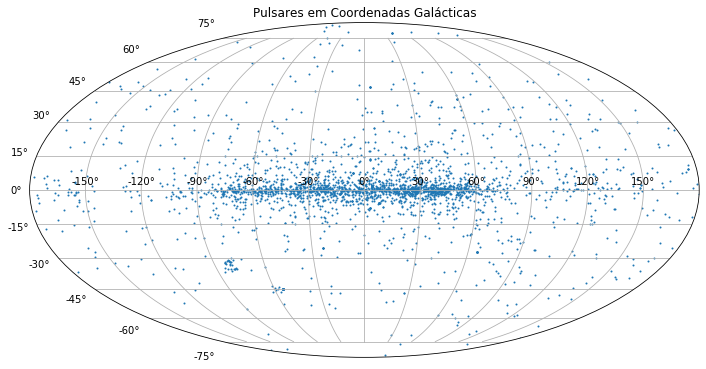
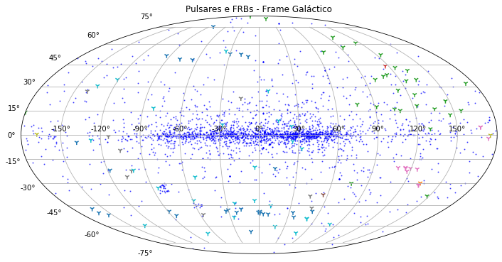
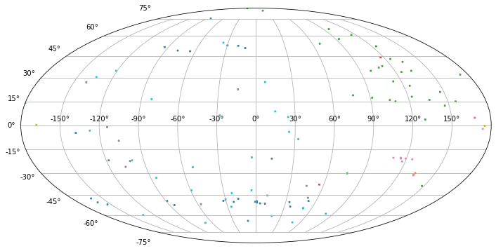

```python
# Importando os módulos necessários
import numpy as np
import matplotlib.pyplot as plt
from astropy.io import ascii
from astropy.coordinates import SkyCoord
import astropy.coordinates as coord
import astropy.units as u
import pandas as pd
```

## Pulsares

Podemos acessar o catálogo de pulsares em https://www.atnf.csiro.au/research/pulsar/index.html

"The ATNF Pulsar Catalogue", R. N. Manchester, G. B. Hobbs, A. Teoh & M. Hobbs, Astronomical Journal, 129, 1993-2006 (2005) and by quoting the web address http://www.atnf.csiro.au/research/pulsar/psrcat for updated versions.

Este catálogo pode ser acessado online ou pelo programa psrcat. Eu apenas salvei as informações em um formato CSV.


```python
# Lemos os dados, definimos o separador, cuidados do cabeçalho e dos valores esquisitos que aparecem no arquivo.
df = pd.read_csv("ATNFcatalogP0.csv", sep=";", header=0, na_values="*", keep_default_na=True)
#Horrível mas ocabecalho original tem duas linhas, estou jogando uma fora.
df = df.drop([0])
#Voilá
df.head(3)
```


<div>
<style scoped>
    .dataframe tbody tr th:only-of-type {
        vertical-align: middle;
    }

    .dataframe tbody tr th {
        vertical-align: top;
    }

    .dataframe thead th {
        text-align: right;
    }
</style>
<table border="1" class="dataframe">
  <thead>
    <tr style="text-align: right;">
      <th></th>
      <th>num</th>
      <th>NAME</th>
      <th>Gl</th>
      <th>Gb</th>
      <th>RAJD</th>
      <th>DECJD</th>
      <th>P0</th>
      <th>DM</th>
      <th>S1400</th>
      <th>R_LUM14</th>
      <th>Unnamed: 10</th>
    </tr>
  </thead>
  <tbody>
    <tr>
      <th>1</th>
      <td>1</td>
      <td>J0002+6216</td>
      <td>117.327</td>
      <td>-0.074</td>
      <td>0.742375</td>
      <td>62.269278</td>
      <td>0.115364</td>
      <td>218.60</td>
      <td>0.02</td>
      <td>8.90e-01</td>
      <td>NaN</td>
    </tr>
    <tr>
      <th>2</th>
      <td>2</td>
      <td>J0006+1834</td>
      <td>108.172</td>
      <td>-42.985</td>
      <td>1.520000</td>
      <td>18.583056</td>
      <td>0.693748</td>
      <td>11.41</td>
      <td>NaN</td>
      <td>NaN</td>
      <td>NaN</td>
    </tr>
    <tr>
      <th>3</th>
      <td>3</td>
      <td>J0007+7303</td>
      <td>119.660</td>
      <td>10.463</td>
      <td>1.757083</td>
      <td>73.052056</td>
      <td>0.315873</td>
      <td>NaN</td>
      <td>NaN</td>
      <td>NaN</td>
      <td>NaN</td>
    </tr>
  </tbody>
</table>
</div>


### Coordenadas Galacticas


```python
# pandas não reconheceu l e b como números, corrigimos isto aqui.
df["Gl"] = df.Gl.astype(float)
df["Gb"] = df.Gb.astype(float)
```


```python
# Vamos usar uma coordenada do tipo ângulo do astropy.
# a Longitude Galáctica vai de é um ângulo de -180 a 180
# Passamos tudo para radianos
GL = coord.Angle(df.Gl*u.degree)
GL = GL.wrap_at(180*u.degree)
df["GB"] = coord.Angle(df.Gb*u.degree).radian
df["GL"] = GL.radian
```


```python
fig = plt.figure(figsize=(12,8))
ax = fig.add_subplot(111, projection="mollweide")
ax.set_title("Pulsares em Coordenadas Galácticas")
ax.scatter(df.GL, df.GB, s = 1)
ax.grid(True)
#fig.savefig('PulsarsG.png', dpi=150)
plt.show();
```





### Coordenadas Equatoriais


```python
# Astropy sabe transformar os sistemas de coordenadas.
DATA = SkyCoord(l = df.GL, b = df.GB, frame = "galactic", unit = u.rad )
DATARaDec = DATA.icrs
```


```python
# Ascenção Reta é um ângulo de -180 a 180
# Skycoord devolve os parâmetros em ângulos, vamos voltar para radianos, por causa do plot.
RAradian = DATARaDec.ra.wrap_at(180*u.degree).radian
DECradian = DATARaDec.dec.radian
```


```python
fig = plt.figure(figsize=(12,8))
ax = fig.add_subplot(111, projection="mollweide")
ax.set_title("Pulsares em Coordenadas Equatoriais")
ax.scatter(RAradian, DECradian, s = 1, c="red")
ax.grid(True)
#fig.savefig('PulsarsICRS.png', dpi=150)
plt.show();
```


## Fast Radio Bursts

 Também temos um catálogo de FRBs disponíveis facilmente.

 *The most recent version of the catalogue database and previous versions are available in CSV format on Zenodo at the DOI: http://www.frbcat.org/frbcat.csv*


```python
FRB = pd.read_csv("frbcat_20200305.csv")
```


```python
# Mesmo procedimento utilizado para os pulsares.
GL_F = coord.Angle(FRB.rop_gl*u.degree)
GL_F = GL_F.wrap_at(180*u.degree)
FRB["GB"] = coord.Angle(FRB.rop_gb*u.degree).radian
FRB["GL"] = GL_F.radian
FRB["telescope"]=FRB.telescope.astype("category")
```


```python
import warnings
warnings.filterwarnings("ignore", category=RuntimeWarning)

```


```python
# Vamos pintar os FRBs pelo equipamento que o descobriu
import matplotlib.cm as cm
fig = plt.figure(figsize=(12,8))
ax = fig.add_subplot(111, projection="mollweide")
ax.set_title("Pulsares e FRBs - Frame Galáctico")
ax.scatter(x = df.GL, y=df.GB, c = "blue", s=1, alpha = 0.6)
ax.scatter(x = FRB.GL, y = FRB.GB, marker = "1", s=50, c= FRB.telescope.cat.codes, cmap=cm.tab10)
ax.grid(True)
#fig.savefig('Pulsars_FRB_Gal.png', dpi=150)
plt.show();
```





```python
fig = plt.figure(figsize=(12,8))
ax = fig.add_subplot(111, projection="mollweide")
PONTOS = ax.scatter(x = FRB.GL, y = FRB.GB, marker = "x", s = 5, alpha=0.90, c= FRB.telescope.cat.codes, cmap=cm.tab10)
ax.grid(True)
#fig.savefig('Pulsars_FRB_Gal.png', dpi=150)
plt.show();
```





```python

```
