---

title: "Distribuição de Renda no Brasil"
description: "O que de verdade uma grande fortuna? Quais carreiras são melhor remuneradas? Um pequeno passeio nos dados sumarizados da receita federal"
Date: "2020-03-29"  
Author: "Luciano Barosi"
Categories: ["Python","Data Science"]
Tags: ["Brasil", "Renda"] 
featured: true
---
# Grandes Fortunas no Brasil

## Inicialização


```python
# show result from all calculations of the cell
from IPython.core.interactiveshell import InteractiveShell
InteractiveShell.ast_node_interactivity = "all"
```


```python
# Kernel Python
import os
import sys
os.chdir(sys.path[0])
dirpath = os.getcwd()
print("Diretório atual: " + dirpath)
```

    Diretório atual: /home/lbarosi/Pythonia/GrandesFortunas


```python
import numpy as np
from scipy import stats
import matplotlib.pyplot as plt 
import matplotlib.ticker as ticker
import pandas as pd
import seaborn as sns
```

## Proposta

Vamos utilizar os dados da Receita Federal disponíveis para procurar fazer uma boa visualização de dados sobre o que é de fato uma grande fortuna, para que casa pessoa possa se enxergar de maneira razoavelmente realista na pirâmide de renda e na distribuição por percentis.

Adicionalmente, queremos  vamos observar a participação no imposto de renda por Natureza de Ocupação e por Ocupação.

## Dados

A [Receita Federal](http://receita.economia.gov.br/dados/receitadata/estudos-e-tributarios-e-aduaneiros/estudos-e-estatisticas/distribuicao-da-renda-por-centis/dados-informacoes-e-graficos-setoriais-2008-a-2012) possui uma base de dados com informações agregadas da basew de dados de declaração de impostos de renda no Brasil. Vamos utilizar as tabelas de **Distribuição da Renda por Centis** para o ano de **2018**, último ano disponível no momento de criação deste notebook.

O Salário mínimo é utilizado como base de cálculo das aliquotas, para o ano de 2017 (referente ao ano da declaração de **2018**) o valor do salário segue abaixo, expresso em reais.


```python
SM = 937.0
```

As alíquotas de imposto de renda para o ano base adotado são:


```python
Faixas = { 0 : 1903.99,
           1 : 2826.65,
           2 : 3751.05,
           3 : 4664.68,
           4 : 4664.68}
Aliquota = { 0 : 0.,
             1 : 0.075,
             2 : 0.15,
             3 : 0.225,
             4 : 0.275}
```

O imposto de grandes fortunas prevê três faixas de tributação. Quem tem patrimônio líquido entre 12 mil e 20 mil vezes o limite de isenção (entre $R\$ $ 22,8 milhões e $R\$ $ 38 milhões) paga 0,5% de imposto. As fortunas entre 20 mil e 70 mil vezes (entre $R\$ $ 38 milhões e $R\$ $ 133,2 milhões) pagam 0,75%. Milionários com patrimônio acima desse valor são tributados em 1%.

As classes de renda no Brasil tem muitas definições, vamos adotar uma definição baseada na renda, tendo como base o salário mínimo. Esta é a definição mais fácil de ser aplicada nos dados e comparada em qualquer série temporal.


```python
# Faixas 0.5, 0.75, 1
classeB = [10*SM*12, 20*SM*12]
classeC = [4*SM*12, 10*SM*12]
classeD = [2*SM*12, 4*SM*12]
```

A tabela em excel da receita federal não é útil para análise de dados automatizada, selecionamos algumas colunas e colocamos em um formato adequado para o pandas em uma tabela *csv*.

Consideramos a tabela disponível para as informações consolidadas **RB2** que inclui renda tributável, participações societárias, lucros e dividendos e rendas sujeitas a tributação exclusiva.

Selecionamos os percentis (**centil**), o número de contribuintes (**contribuinte**), o limite superior do percentil (**centil_SUP** em R\$), a média de renda do percentil (**media** em R\$) e o importo devido da faixa (**IR** em milhões de R\$). 


```python
df = pd.read_csv("./DATA/centis-ac2018.csv", sep = ";")
```

## Análise

Criamos uma amostra da população em cada percentil dividindo a quantidade da população do percentil por 100 e distribuimos suas rendas de maneira uniforme no intervalo. O intuito aqui é puramente gráfico, para mostrar a densidade de pessoas em cada faixa de renda.


```python
tmp = np.empty(len(df.media), dtype=object)
for i in np.arange(0,len(df.media)):
    def step(x):
        if x< 90:
            return 0.5
        else:
            return 0.05
    st = step(df.centil[i])
    passo = 2*st
    tmp[i] = np.array([df.centil[i]-st + np.random.uniform(0,passo,int(df.contribuinte[i]/100)),
                       np.random.uniform(0, df.centil_SUP[i], int(df.contribuinte[i]/100))])

```

Agora podemos visualizar a distribuição de renda por percentil. Para que tenhamos alguma referência, indicamos os limites das classes sociais D, C, B, e A, bem como o que serião as classes de grandes fortunas (que se dividiriam também em C, B e A.

Também marcamos a linha da pobreza e a linha que indica o teto do salário no Judiciário.

A diferença de escalas é muito grande e é necessário uma escala logarítmica para viasualizar os dados. Mesmo esta escala não é muito fácil fazer todos os percentis aparecerem. Os dados se espalham por 7 ordens de grandeza. 


```python
fig = plt.figure(figsize = (14,4))
fig.suptitle("Percentis de renda do Brasil em 2018 e classes econômicas", fontsize=14, fontweight='bold')
ax = fig.add_subplot(111 )

for cent in np.arange(5,tmp.shape[0]):
    plt.scatter(x = tmp[cent][0], y = tmp[cent][1], s = 5, marker=".", alpha = 0.1)
x = np.linspace(99,100.05,200)
ax.fill_between(x, Faixas[0]*12000, Faixas[0]*20000, alpha = 0.7, label = "Grandes Fortunas B")
ax.fill_between(x, Faixas[0]*20000, Faixas[0]*70000, alpha = 0.7, label = "Grandes Fortunas C")

x = np.linspace(df[df.centil_SUP < classeB[1]].centil.max(), 100.05,200)
ax.fill_between(x, classeB[1], 12*39*SM, alpha = 0.7, label = "Classe A")

x = np.linspace(df[df.centil_SUP < classeB[0]].centil.max(), df[df.centil_SUP < classeB[1]].centil.max(), 200)
ax.fill_between(x, *classeB, alpha = 0.7, label = "Classe B:")

x = np.linspace(df[df.centil_SUP < classeC[0]].centil.max(), df[df.centil_SUP < classeC[1]].centil.max(), 200)
ax.fill_between(x, *classeC, alpha = 0.7, label = "Classe C")

x = np.linspace(df[df.centil_SUP < classeD[0]].centil.max(), df[df.centil_SUP < classeD[1]].centil.max(), 200)
ax.fill_between(x, *classeD, alpha = 0.7, label = "Classe D")

ax.axhline(12*39*SM, linewidth=2.5, linestyle = "dashed", label = "Teto do Judiciario");
ax.axhline(365*3.4*5.5, linewidth=2.5, linestyle = "dotted", color = "red", label = "Linha da Pobreza");
ax.set_yscale("log")
ax.scatter(x = df.centil, y = df.media, marker = "x", c = "red", label= "media de renda")
ax.set_ylim(100,10000000000)
ax.set_xlim(1,101)
ax.set_title("Cada ponto corresponde a cerca de 3000 pessoas para cada 1%")
ax.set_ylabel("Renda Bruta Anual (Log)")
ax.set_xlabel("Percentil de renda")
plt.grid()
plt.legend(loc='upper left')
#fig.savefig('GrandesFortunas.png', dpi=300)
plt.show();
```


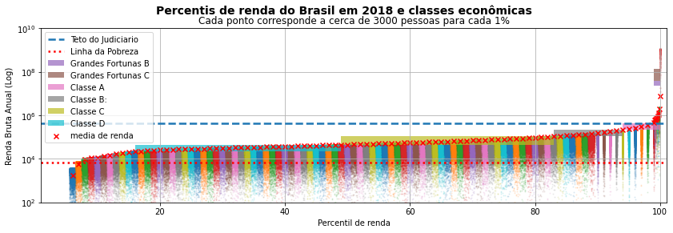


Vamos agora observar com mais detalhe os percentis mais altos. Observamos que a distância entre as classes B e A e a extrema pobreza são menores do que as distâncias até o início da marca das grandes fortunas.

Na definição atual de grandes fortunas, apenas uma pequena parte do percentil 99.9 - 100 é considerado grande fortuna, ou seja, as pessoas 100 vezes mais ricas do que a classe A típica. No gráfico abaixo, sem uma escala logarítmica, a classe B sequer apareceria!


```python
fig = plt.figure(figsize = (14,4))
fig.suptitle("Percentis de renda do Brasil em 2018 e classes econômicas", fontsize=14, fontweight='bold')
ax = fig.add_subplot(111 )

for cent in np.arange(5,tmp.shape[0]):
    plt.scatter(x = tmp[cent][0], y = tmp[cent][1], s = 5, marker=".", alpha = 0.1)
x = np.linspace(99,100.05,200)
ax.fill_between(x, Faixas[0]*12000, Faixas[0]*20000, alpha = 0.7, label = "Grandes Fortunas B")
ax.fill_between(x, Faixas[0]*20000, Faixas[0]*70000, alpha = 0.7, label = "Grandes Fortunas C")

x = np.linspace(df[df.centil_SUP < classeB[1]].centil.max(), 100.05,200)
ax.fill_between(x, classeB[1], 12*39*SM, alpha = 0.7, label = "Classe A")

x = np.linspace(df[df.centil_SUP < classeB[0]].centil.max(), df[df.centil_SUP < classeB[1]].centil.max(), 200)
ax.fill_between(x, *classeB, alpha = 0.7, label = "Classe B:")

x = np.linspace(df[df.centil_SUP < classeC[0]].centil.max(), df[df.centil_SUP < classeC[1]].centil.max(), 200)
ax.fill_between(x, *classeC, alpha = 0.7, label = "Classe C")

x = np.linspace(df[df.centil_SUP < classeD[0]].centil.max(), df[df.centil_SUP < classeD[1]].centil.max(), 200)
ax.fill_between(x, *classeD, alpha = 0.7, label = "Classe D")

ax.axhline(12*39*SM, linewidth=2.5, linestyle = "dashed", label = "Teto do Judiciario");
ax.axhline(365*3.4*5.5, linewidth=2.5, linestyle = "dotted", color = "red", label = "Linha da Pobreza");
ax.set_yscale("log")
ax.scatter(x = df.centil, y = df.media, marker = "x", c = "red", label= "media de renda")
ax.set_ylim(100,10000000000)
ax.set_xlim(90,101)
ax.set_title("Zoom no topo da pirâmide")
ax.set_ylabel("Renda Bruta Anual (Log)")
ax.set_xlabel("Percentil de renda")
plt.grid()
plt.legend(loc='upper left')
#fig.savefig('GrandesFortunas.png', dpi=300)
plt.show();
```


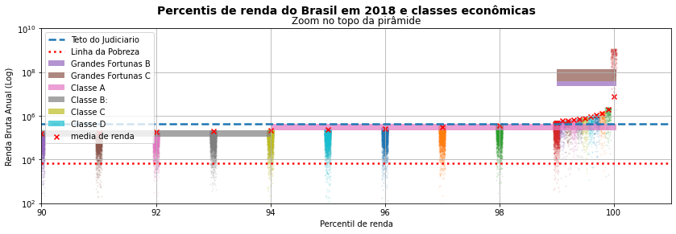


O imposto de renda pago por cada contribuinte pode ser representado por uma alíquota efetiva, que leva em conta as diferentes faixas do imposto. Vamos aqui calcular a Alíquota efetiva por percentil.

Para fazer isto vamos considerar o número de pessoas no percentil com renda dada pela média de renda do percentil, o que correspone a um total de renda do percentil. 

A tabela da receita apresenta também a informação de quanto foi o IR devido para todo o percentil. A razão entre estes dois números vai informar uma alíquota efetiva.

Vemos que  crescimento da alíquota efetiva tem um padrão curioso nos percentis mais altos.


```python
df["Efetivo"] = df.IR*1000000/(df.media*df.contribuinte)
df = df.dropna()
```


```python
fig = plt.figure(figsize = (15,5))
fig.suptitle("Alíquota efetiva de IR por percentil dos contribuintes", fontsize=14, fontweight='bold')
ax = fig.add_subplot(111 )
for i in np.arange(5,len(df.centil)-7):
    x = np.linspace(df.centil[i]-0.5, df.centil[i]+0.5,10)
    ax.fill_between(x, df.Efetivo[i])
for i in np.arange(98,len(df.centil)+4):
    x = np.linspace(df.centil[i]-0.05, df.centil[i]+0.05,10)
    ax.fill_between(x, df.Efetivo[i])
#ax.fill_between(np.linspace(99.55, 100.55,10), df.IR[-10:].sum(), 
#                color="b", 
#                alpha = 0.2)
ax.set_title("Apenas classes C, B e A")
ax.set_ylabel("Alíquota Efetiva")
ax.set_xlabel("Percentil de renda")
ax.set_xlim(30,105)
#plt.legend()
#fig.savefig('ImpostoEfetivo.png', dpi=300)
plt.grid()
plt.show();
```


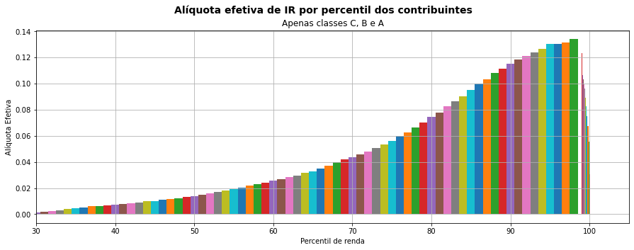


```python
fig = plt.figure(figsize = (15,5))
fig.suptitle("Alíquota efetiva de IR por percentil dos contribuintes", fontsize=14, fontweight='bold')
ax = fig.add_subplot(111 )
for i in np.arange(5,len(df.centil)-7):
    x = np.linspace(df.centil[i]-0.5, df.centil[i]+0.5,10)
    ax.fill_between(x, df.Efetivo[i], alpha = 0.6)
for i in np.arange(98,len(df.centil)+4):
    x = np.linspace(df.centil[i]-0.05, df.centil[i]+0.05,10)
    ax.fill_between(x, df.Efetivo[i], alpha = 0.6)
#ax.fill_between(np.linspace(99.55, 100.55,10), df.IR[-10:].sum(), 
#                color="b", 
#                alpha = 0.2)
ax.set_title("Apenas classes C, B e A")
ax.set_ylabel("Alíquota Efetiva")
ax.set_xlabel("Percentil de renda")
ax.set_xlim(90,105)
plt.grid()
#plt.legend()
fig.savefig('ImpostoEfetivo.png', dpi=300)
plt.show();
```


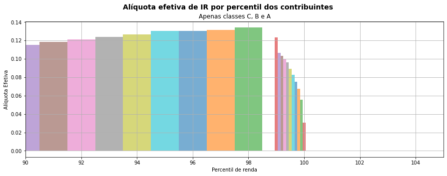


```python
fig = plt.figure(figsize = (15,5))
fig.suptitle("Imposto Devido Total por percentil dos contribuintes", fontsize=14, fontweight='bold')
ax = fig.add_subplot(111 )
for i in np.arange(5,len(df.centil)-6):
    x = np.linspace(df.centil[i]-0.5, df.centil[i]+0.5,10)
    ax.fill_between(x, df.IR[i])
for i in np.arange(99,len(df.centil)+4):
    x = np.linspace(df.centil[i]+0.5-0.05, df.centil[i]+0.5+0.05,10)
    ax.fill_between(x, df.IR[i])
ax.fill_between(np.linspace(99.55, 100.55,10), df.IR[-10:].sum(), 
                color="b", 
                alpha = 0.2)
x = np.linspace(df[df.centil_SUP < classeB[1]].centil.max(), 100.05,200)
ax.fill_between(x, 20000, 21000, alpha = 0.6, label = "Classe A")

x = np.linspace(df[df.centil_SUP < classeB[0]].centil.max(), df[df.centil_SUP < classeB[1]].centil.max(), 200)
ax.fill_between(x, 20000, 21000, alpha = 0.6, label = "Classe B:")

x = np.linspace(df[df.centil_SUP < classeC[0]].centil.max(), df[df.centil_SUP < classeC[1]].centil.max(), 200)
ax.fill_between(x, 20000, 21000, alpha = 0.6, label = "Classe C")

x = np.linspace(df[df.centil_SUP < classeD[0]].centil.max(), df[df.centil_SUP < classeD[1]].centil.max(), 200)
ax.fill_between(x, *classeD, alpha = 0.7, label = "Classe D")
ax.set_title("Apenas classes C, B e A")
ax.set_ylabel("Valor Devido do IR (R\$ milhões)")
ax.set_xlabel("Percentil de renda")
ax.set_xlim(50,105)
ax.set_ylim(0,30000)
plt.grid()
#ax.set_yscale("log")
#plt.legend()
fig.savefig('ImpostoEfetivo.png', dpi=300)
plt.show();
```


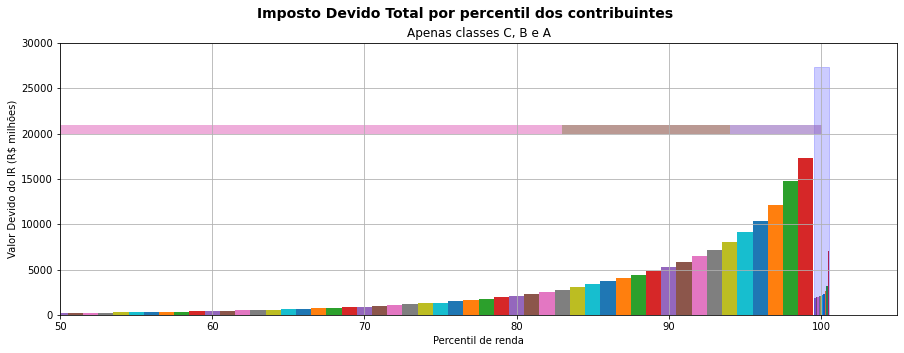


O 1% mais rica da população contribui com mais imposto do que 78% dos contribuintes somados. Por outro lado, a média de renda do pecentil 99.9 é maior do que todas as rendas somadas até o percentil 97!


```python
df.IR[-10:].sum() < df.IR[0:76].sum();
df.IR[-10:].sum() < df.IR[0:77].sum();
df.centil[77];
```


```python
df.media[-1:].sum() < df.media[0:96].sum();
df.centil[-1:];
df.centil[96];
```

## Dados por Natureza de Ocupação


```python
df_Nat = pd.read_excel("./DATA/RELATORIO_2017.xlsx",
              sheet_name="NATUREZA")  
df_Ocu = pd.read_excel("./DATA/RELATORIO_2017.xlsx",
              sheet_name="OCUPACAO")  
```


```python
df_Nat = df_Nat.drop(columns = ["NATUREZA_DA_OCUPACAO"]).groupby("TIPO").sum()
df_Nat["FRACAO_Declarantes"] = df_Nat.QTDE_DECLARANTES/df_Nat.QTDE_DECLARANTES.sum()
df_Nat["FRACAO_RTL"] = df_Nat.RTL/df_Nat.RTL.sum()
df_Nat["FRACAO_IR"] = df_Nat.IR/df_Nat.IR.sum()

df_Nat["RTL_capita"] = 1000000000*df_Nat.RTL/(df_Nat.QTDE_DECLARANTES*13)
df_Nat["IR_capita"] = 1000000000*df_Nat.IR/df_Nat.QTDE_DECLARANTES

df_Nat = df_Nat.reset_index()
df_Nat = df_Nat.drop(
    columns = ["QTDE_DECLARANTES", "RT_EXCLUSIVO", "RT", "RISENTO", "RTL", "IR"])\
    .melt(id_vars=["TIPO"], var_name="fracao", value_name="Value")
df_Nat.TIPO = df_Nat.TIPO.astype('category')
```


```python
df_Ocu = df_Ocu.drop(columns = ["OCUPACAO"]).groupby("Tipo").sum()
df_Ocu["FRACAO_Declarantes"] = df_Ocu.QTDE_DECLARANTES/df_Ocu.QTDE_DECLARANTES.sum()
df_Ocu["FRACAO_RTL"] = df_Ocu.RTL/df_Ocu.RTL.sum()
df_Ocu["FRACAO_IR"] = df_Ocu.IR/df_Ocu.IR.sum()
df_Ocu["RTL_capita"] = 1000000000*df_Ocu.RTL/(df_Ocu.QTDE_DECLARANTES*13)
df_Ocu["IR_capita"] = 1000000000*df_Ocu.IR/df_Ocu.QTDE_DECLARANTES
df_Ocu = df_Ocu.reset_index()
df_Ocu = df_Ocu.drop(
    columns = ["QTDE_DECLARANTES", "RT_EXCLUSIVO", "RT", "RISENTO", "RTL", "IR"])\
    .melt(id_vars=["Tipo"], var_name="fracao", value_name="Value")
df_Ocu.Tipo = df_Ocu.Tipo.astype('category')
```

As tabelas da receita federal também apresentam dados consolidados por ocupação e profissão. Reorgnizamos as categorias da Receita nas categorias abaixo para facilitar a visualização. A renda média mensal líquida é calculada a partir da soma da renda da categoria, dividida pela população de contribuintes na categoria e dividido por 13, correspondendo ao salário de 12 meses mais o 13 salário..

Funcionários do sistema financeiro público ou privado e servidores públicos apresentam a maior renda, seguidos pelos empregador na iniciativa privada e militares que seguem quase empátados e depois, todos no mesmo nível Autônomos, Pensionistas, pequenas empresas e outros.


```python
df = df_Nat[df_Nat["fracao"].isin(["RTL_capita"])]

fig = plt.figure(figsize = (15,5))
fig.suptitle("Renda Líquida Média Mensal", fontsize=14, fontweight='bold')
ax = fig.add_subplot(111 )
ax = sns.barplot(data=df, x='TIPO', y='Value')

ax.set_xlabel("Natureza da Ocupação")
ax.set_ylabel("R\$")
ax.set_xticklabels(ax.get_xticklabels(), rotation=45, horizontalalignment='right')


plt.grid()
plt.show();


```


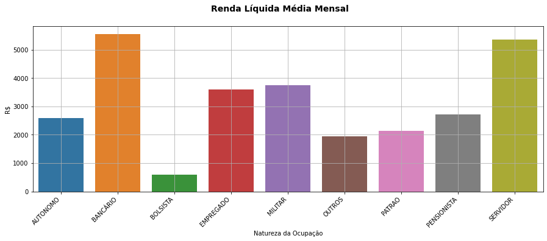


Se observarmos o extrato por profissão temos que levar em consideração que muitas profissões se enquadram em outros, que não estão sendo considerados. O foco é comparar os dados para os servidores públicos do executivo, legislativo e judiciário (junto com Ministerio Público) com militares, professores, funcionários da saúde e padres e pastores.

É fácil observar que o número de declarantes no extrato considerado é majoritariamente de professores. As outras duas colunas se referem a participação do extrato profissional no todo, com respeito a renda total líquida e o imposto devido.

A mudança de proporção entre as colunas indica variações na renda média entre a coluna de declarantes e a coluna de renda líquida e o imposto devido carrega as informações de renda e de representação na população.

A renda édia de servidores do Juciário, servidores de saúde e servidores públicos em geral deve se mostgrar significativamente mais elevada do que as rendas das outras categorias. Podemos estimar que a renda média de militares e de pŕofessores deva ser semelhante.


```python
import matplotlib.ticker as ticker

df = df_Ocu[~df_Ocu["fracao"].isin(["RTL_capita", "IR_capita"])]
df = df[df.Tipo != "OUTROS"]
df.Tipo = df.Tipo.astype(str)
fig = plt.figure(figsize = (15,5))
fig.suptitle("Fração do Total", fontsize=14, fontweight='bold')
ax = fig.add_subplot(111 )

ax = sns.barplot(data=df, x='Tipo', y='Value', hue='fracao')

ax.set_xlabel("Natureza da Ocupação")
ax.set_ylabel("%")
ax.set_xticklabels(ax.get_xticklabels(), rotation=45, horizontalalignment='right')
ax.yaxis.set_major_formatter(ticker.PercentFormatter(xmax=5))

handles, labels = ax.get_legend_handles_labels()
ax.legend(handles = handles, labels=["Declarantes", "Renda Líquida", "Imposto Devido"])

plt.grid()
plt.show();


```


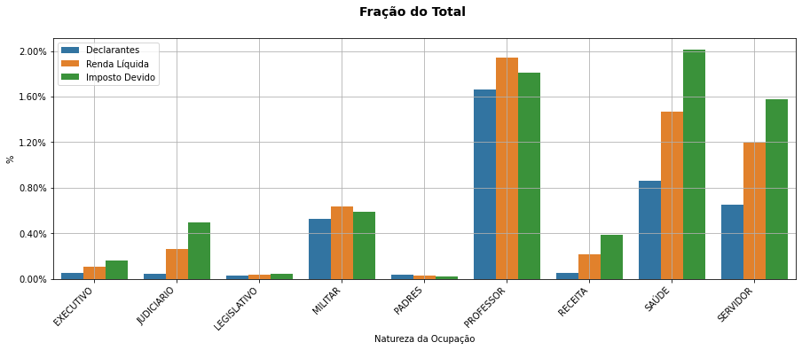


Ao observarmos a renda média mensal entre as diferentes profissões, vemos que o Judiário e os funcionários do Fisco se destacam dos outros, logo depois os servidores do executivo e os servidores em geral.

Chama atenção que os profissionais da Saúde parecem ter uma renda pequena, mas todas as áreas estão agregadas.

Também os professores apresentam uma renda baixa, mas estão agregados diferentes profissionais da educação.


```python
df = df_Ocu[df_Ocu["fracao"].isin(["RTL_capita"])]

fig = plt.figure(figsize = (15,5))
fig.suptitle("Renda Líquida Média Mensal", fontsize=14, fontweight='bold')
ax = fig.add_subplot(111 )
ax = sns.barplot(data=df, x='Tipo', y='Value')

ax.set_xlabel("Natureza da Ocupação")
ax.set_ylabel("R\$")
ax.set_xticklabels(ax.get_xticklabels(), rotation=45, horizontalalignment='right')


plt.grid()
plt.show();
```


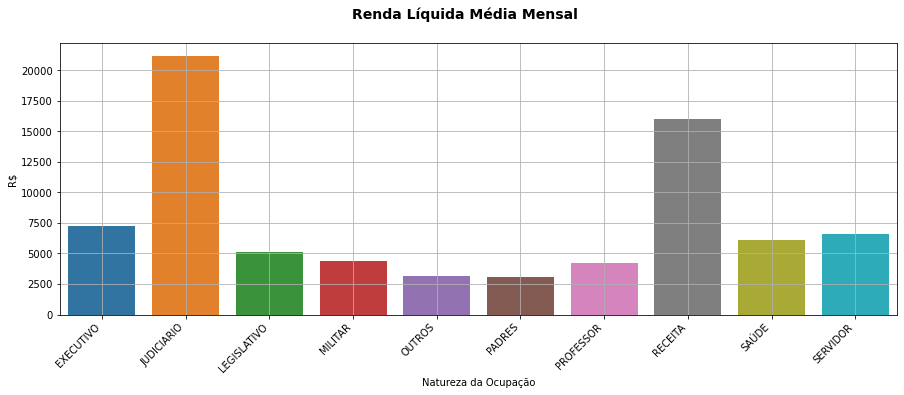


```python
df_OcuZ = pd.read_excel("./DATA/RELATORIO_2017.xlsx",
              sheet_name="OCUPACAO")  
```

Quando observamos os extrados segmentados, vemos que os professores de ensino superior são significativamente melhos remunerados do que os outros. Ganhando essencialmente o dobro dos outros professores.

Também os médicos se destacam, ganhando o triplo do que as outras categoriasda saúde.

Também encontramos uma uniformidade nas carreiras do judiciário e entre os servidores públicos.


```python
prof = "PROFESSOR"
df_Ocu = df_OcuZ[df_OcuZ.Tipo == prof].groupby("OCUPACAO").sum()
df_Ocu["FRACAO_Declarantes"] = df_Ocu.QTDE_DECLARANTES/df_Ocu.QTDE_DECLARANTES.sum()
df_Ocu["FRACAO_RTL"] = df_Ocu.RTL/df_Ocu.RTL.sum()
df_Ocu["FRACAO_IR"] = df_Ocu.IR/df_Ocu.IR.sum()
df_Ocu["RTL_capita"] = 1000000000*df_Ocu.RTL/(df_Ocu.QTDE_DECLARANTES*13)
df_Ocu["IR_capita"] = 1000000000*df_Ocu.IR/df_Ocu.QTDE_DECLARANTES
df_Ocu = df_Ocu.reset_index()
df_Ocu = df_Ocu.drop(
    columns = ["QTDE_DECLARANTES", "RT_EXCLUSIVO", "RT", "RISENTO", "RTL", "IR"])\
    .melt(id_vars=["OCUPACAO"], var_name="fracao", value_name="Value")
df_Ocu.OCUPACAO = df_Ocu.OCUPACAO.astype('category')

df = df_Ocu[df_Ocu["fracao"].isin(["RTL_capita"])]

fig = plt.figure(figsize = (15,5))
fig.suptitle("Renda Líquida Média Mensal - Profissionais de Educação", fontsize=14, fontweight='bold')
ax = fig.add_subplot(111 )
ax = sns.barplot(data=df, x='OCUPACAO', y='Value')

ax.set_xlabel("Natureza da Ocupação")
ax.set_ylabel("R\$")
ax.set_xticklabels(ax.get_xticklabels(), rotation=45, horizontalalignment='right')


plt.grid()
plt.show();
```


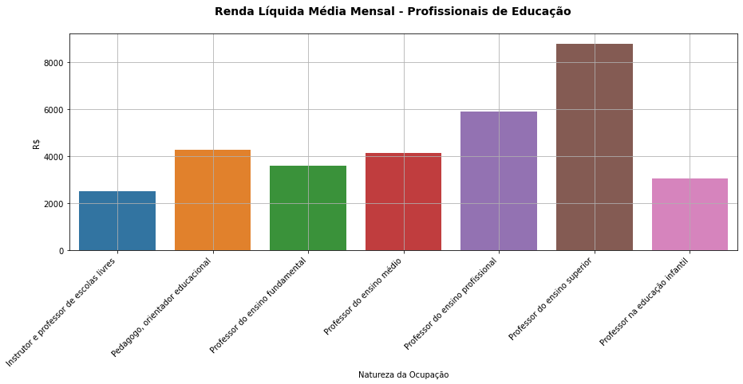


```python
prof = "SAÚDE"
df_Ocu = df_OcuZ[df_OcuZ.Tipo == prof].groupby("OCUPACAO").sum()
df_Ocu["FRACAO_Declarantes"] = df_Ocu.QTDE_DECLARANTES/df_Ocu.QTDE_DECLARANTES.sum()
df_Ocu["FRACAO_RTL"] = df_Ocu.RTL/df_Ocu.RTL.sum()
df_Ocu["FRACAO_IR"] = df_Ocu.IR/df_Ocu.IR.sum()
df_Ocu["RTL_capita"] = 1000000000*df_Ocu.RTL/(df_Ocu.QTDE_DECLARANTES*13)
df_Ocu["IR_capita"] = 1000000000*df_Ocu.IR/df_Ocu.QTDE_DECLARANTES
df_Ocu = df_Ocu.reset_index()
df_Ocu = df_Ocu.drop(
    columns = ["QTDE_DECLARANTES", "RT_EXCLUSIVO", "RT", "RISENTO", "RTL", "IR"])\
    .melt(id_vars=["OCUPACAO"], var_name="fracao", value_name="Value")
df_Ocu.OCUPACAO = df_Ocu.OCUPACAO.astype('category')

df = df_Ocu[df_Ocu["fracao"].isin(["RTL_capita"])]

fig = plt.figure(figsize = (15,5))
fig.suptitle("Renda Líquida Média Mensal - Profissionais da Saúde", fontsize=14, fontweight='bold')
ax = fig.add_subplot(111 )
ax = sns.barplot(data=df, x='OCUPACAO', y='Value')

ax.set_xlabel("Natureza da Ocupação")
ax.set_ylabel("R\$")
ax.set_xticklabels(ax.get_xticklabels(), rotation=45, horizontalalignment='right')


plt.grid()
plt.show();
```


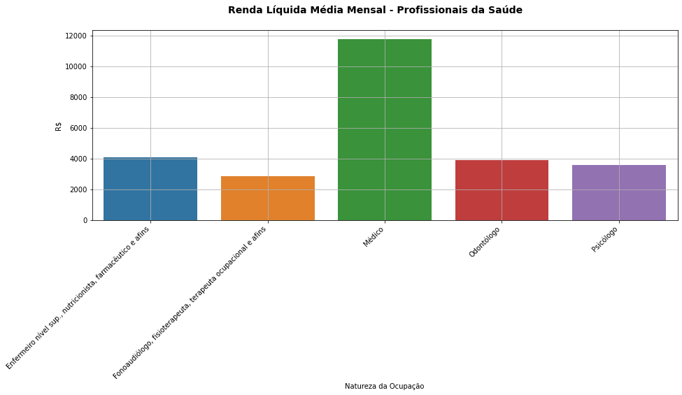


```python
prof = "SERVIDOR"
df_Ocu = df_OcuZ[df_OcuZ.Tipo == prof].groupby("OCUPACAO").sum()
df_Ocu["FRACAO_Declarantes"] = df_Ocu.QTDE_DECLARANTES/df_Ocu.QTDE_DECLARANTES.sum()
df_Ocu["FRACAO_RTL"] = df_Ocu.RTL/df_Ocu.RTL.sum()
df_Ocu["FRACAO_IR"] = df_Ocu.IR/df_Ocu.IR.sum()
df_Ocu["RTL_capita"] = 1000000000*df_Ocu.RTL/(df_Ocu.QTDE_DECLARANTES*13)
df_Ocu["IR_capita"] = 1000000000*df_Ocu.IR/df_Ocu.QTDE_DECLARANTES
df_Ocu = df_Ocu.reset_index()
df_Ocu = df_Ocu.drop(
    columns = ["QTDE_DECLARANTES", "RT_EXCLUSIVO", "RT", "RISENTO", "RTL", "IR"])\
    .melt(id_vars=["OCUPACAO"], var_name="fracao", value_name="Value")
df_Ocu.OCUPACAO = df_Ocu.OCUPACAO.astype('category')

df = df_Ocu[df_Ocu["fracao"].isin(["RTL_capita"])]

fig = plt.figure(figsize = (15,5))
fig.suptitle("Renda Líquida Média Mensal - Servidor Público", fontsize=14, fontweight='bold')
ax = fig.add_subplot(111 )
ax = sns.barplot(data=df, x='OCUPACAO', y='Value')

ax.set_xlabel("Natureza da Ocupação")
ax.set_ylabel("R\$")
ax.set_xticklabels(ax.get_xticklabels(), rotation=45, horizontalalignment='right')


plt.grid()
plt.show();
```


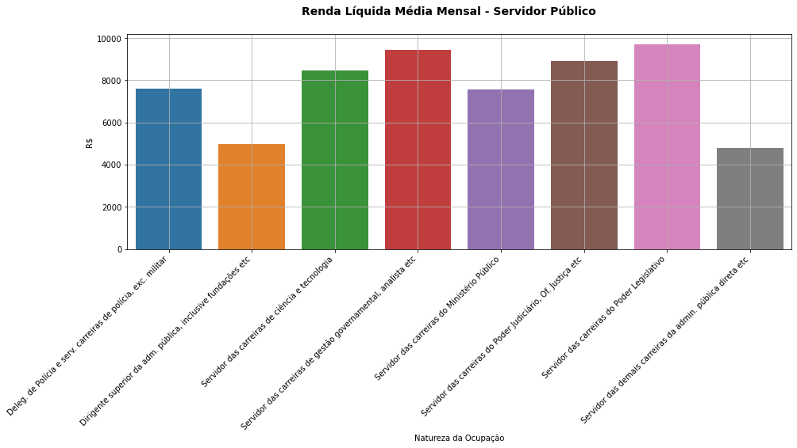


```python
prof = "JUDICIARIO"
df_Ocu = df_OcuZ[df_OcuZ.Tipo == prof].groupby("OCUPACAO").sum()
df_Ocu["FRACAO_Declarantes"] = df_Ocu.QTDE_DECLARANTES/df_Ocu.QTDE_DECLARANTES.sum()
df_Ocu["FRACAO_RTL"] = df_Ocu.RTL/df_Ocu.RTL.sum()
df_Ocu["FRACAO_IR"] = df_Ocu.IR/df_Ocu.IR.sum()
df_Ocu["RTL_capita"] = 1000000000*df_Ocu.RTL/(df_Ocu.QTDE_DECLARANTES*13)
df_Ocu["IR_capita"] = 1000000000*df_Ocu.IR/df_Ocu.QTDE_DECLARANTES
df_Ocu = df_Ocu.reset_index()
df_Ocu = df_Ocu.drop(
    columns = ["QTDE_DECLARANTES", "RT_EXCLUSIVO", "RT", "RISENTO", "RTL", "IR"])\
    .melt(id_vars=["OCUPACAO"], var_name="fracao", value_name="Value")
df_Ocu.OCUPACAO = df_Ocu.OCUPACAO.astype('category')

df = df_Ocu[df_Ocu["fracao"].isin(["RTL_capita"])]

fig = plt.figure(figsize = (15,5))
fig.suptitle("Renda Líquida Média Mensal - JUDICIÁRIO", fontsize=14, fontweight='bold')
ax = fig.add_subplot(111 )
ax = sns.barplot(data=df, x='OCUPACAO', y='Value')

ax.set_xlabel("Natureza da Ocupação")
ax.set_ylabel("R\$")
ax.set_xticklabels(ax.get_xticklabels(), rotation=45, horizontalalignment='right')


plt.grid()
plt.show();
```


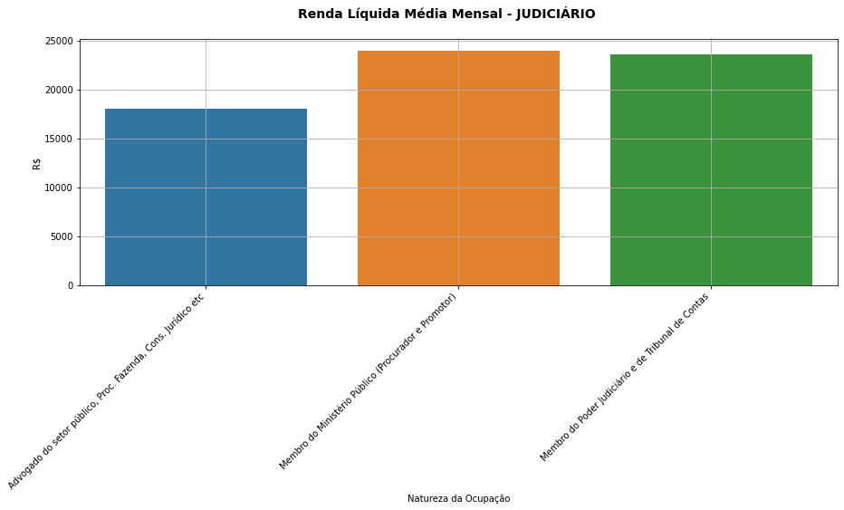


```python
prof = "EXECUTIVO"
df_Ocu = df_OcuZ[df_OcuZ.Tipo == prof].groupby("OCUPACAO").sum()
df_Ocu["FRACAO_Declarantes"] = df_Ocu.QTDE_DECLARANTES/df_Ocu.QTDE_DECLARANTES.sum()
df_Ocu["FRACAO_RTL"] = df_Ocu.RTL/df_Ocu.RTL.sum()
df_Ocu["FRACAO_IR"] = df_Ocu.IR/df_Ocu.IR.sum()
df_Ocu["RTL_capita"] = 1000000000*df_Ocu.RTL/(df_Ocu.QTDE_DECLARANTES*13)
df_Ocu["IR_capita"] = 1000000000*df_Ocu.IR/df_Ocu.QTDE_DECLARANTES
df_Ocu = df_Ocu.reset_index()
df_Ocu = df_Ocu.drop(
    columns = ["QTDE_DECLARANTES", "RT_EXCLUSIVO", "RT", "RISENTO", "RTL", "IR"])\
    .melt(id_vars=["OCUPACAO"], var_name="fracao", value_name="Value")
df_Ocu.OCUPACAO = df_Ocu.OCUPACAO.astype('category')

df = df_Ocu[df_Ocu["fracao"].isin(["RTL_capita"])]

fig = plt.figure(figsize = (15,5))
fig.suptitle("Renda Líquida Média Mensal - EXECUTIVO", fontsize=14, fontweight='bold')
ax = fig.add_subplot(111 )
ax = sns.barplot(data=df, x='OCUPACAO', y='Value')

ax.set_xlabel("Natureza da Ocupação")
ax.set_ylabel("R\$")
ax.set_xticklabels(ax.get_xticklabels(), rotation=45, horizontalalignment='right')


plt.grid()
plt.show();
```


